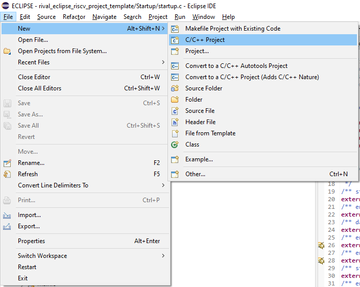
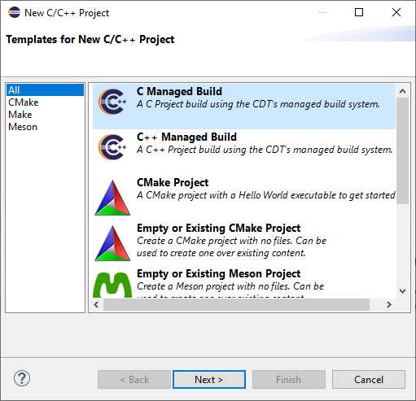
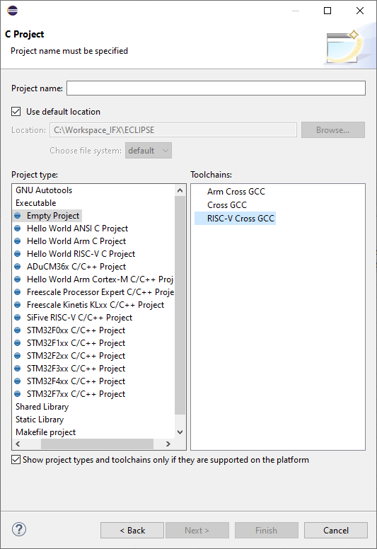
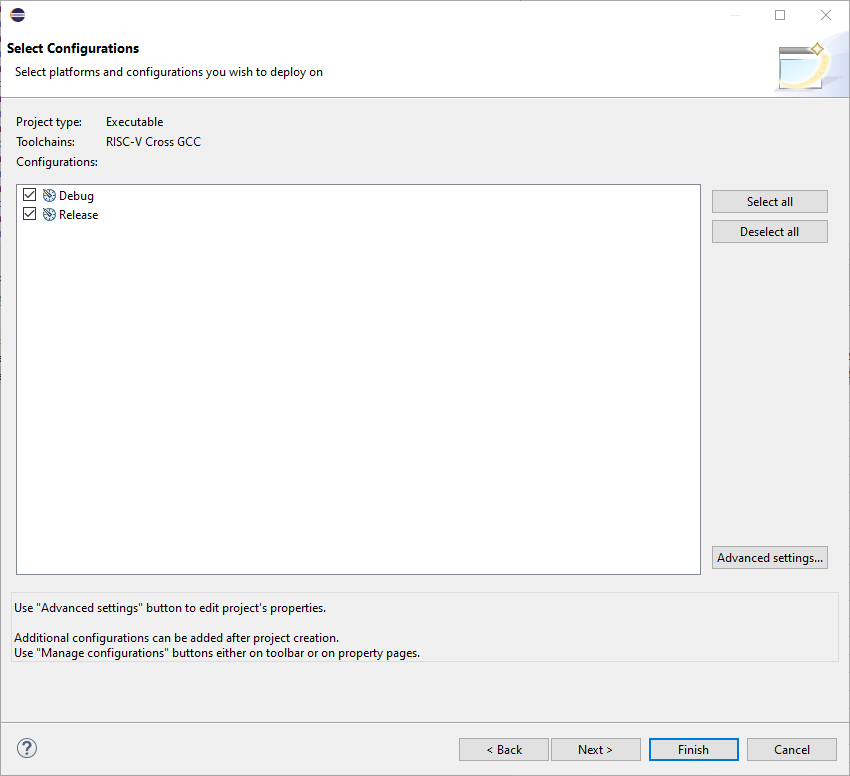
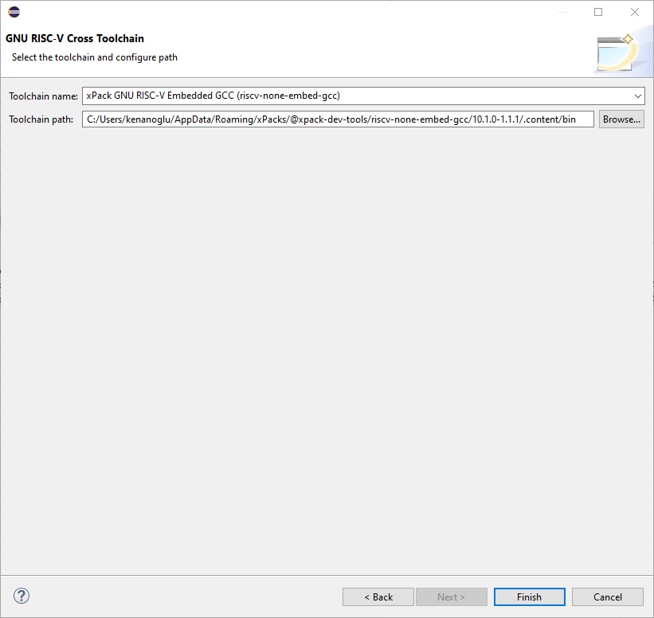
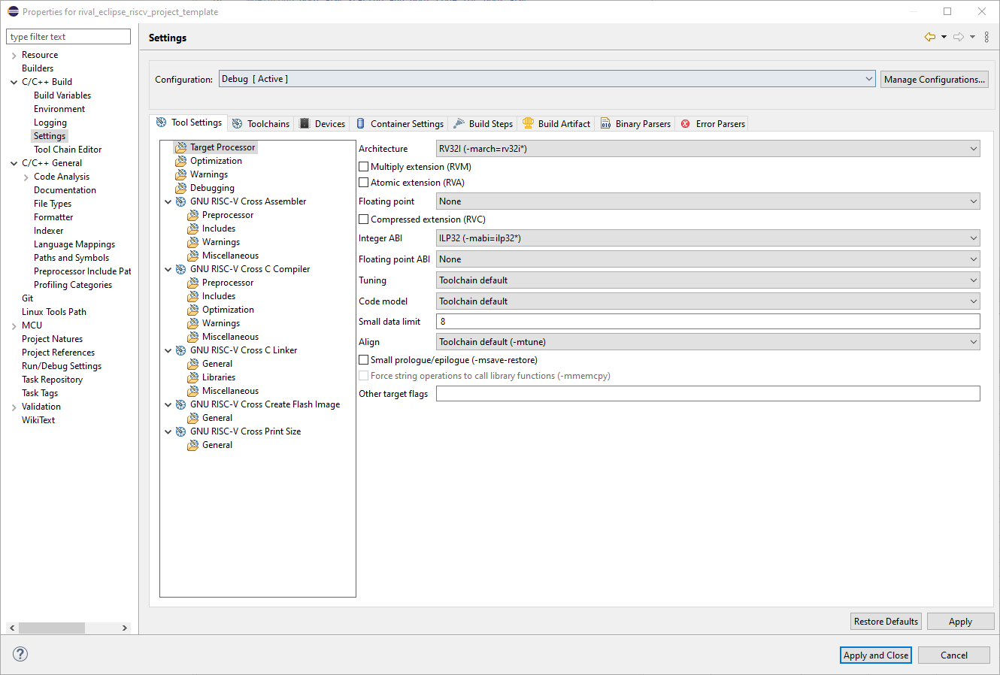
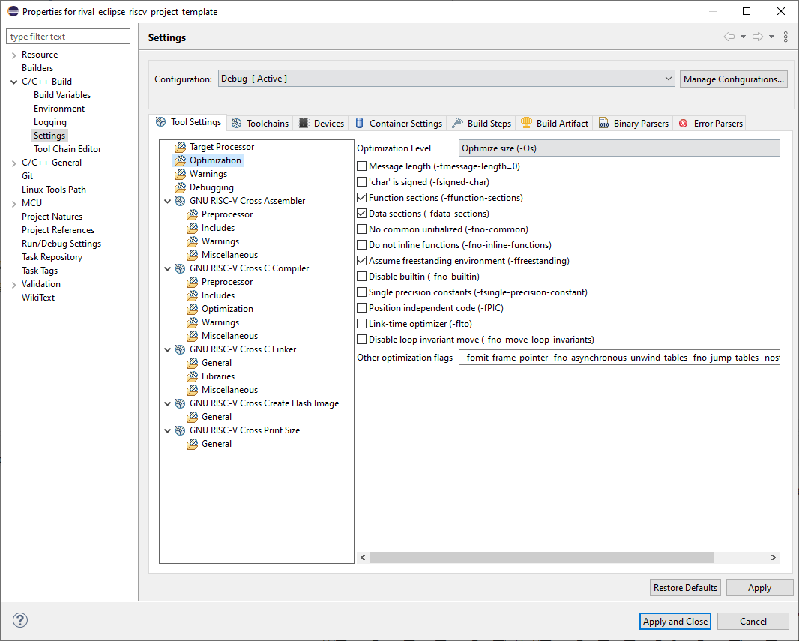
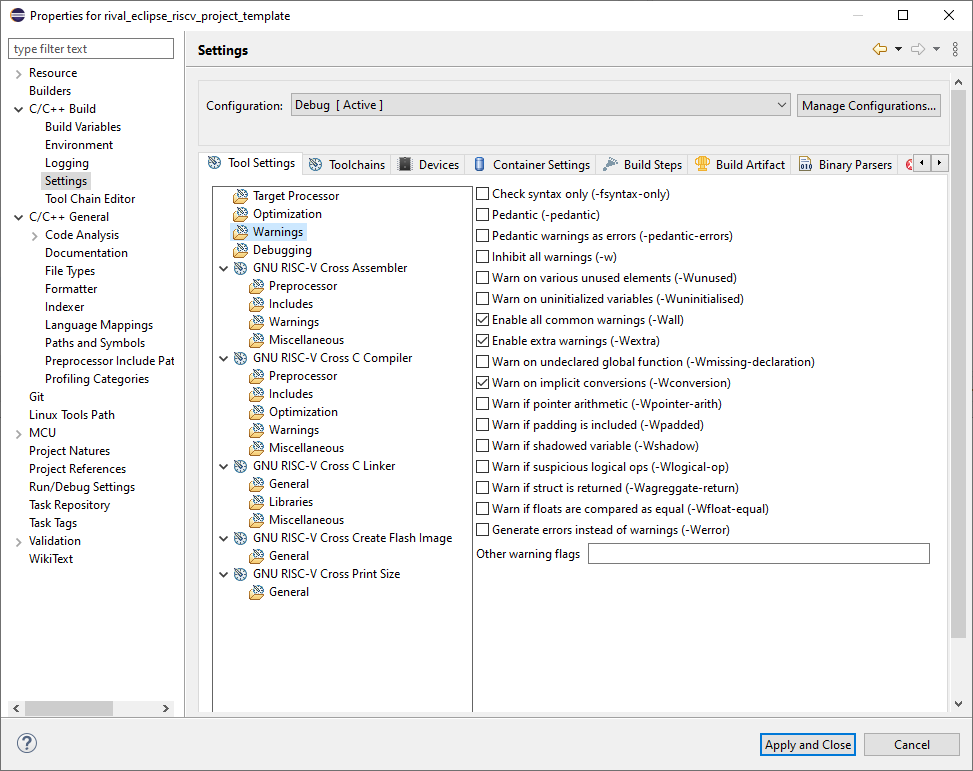
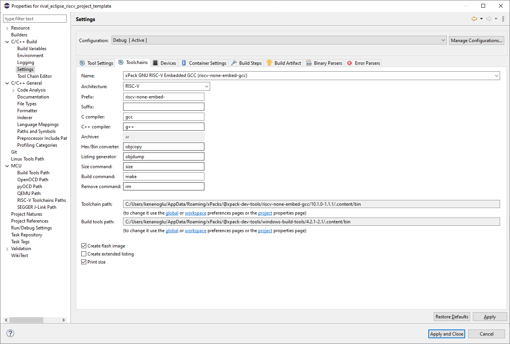
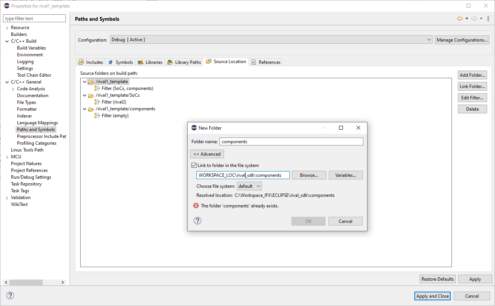

# RISC-V TEMPLATE SDK FOR ECLIPSE IDE

In this project, a template embedded build flow structure created with the SDK layers on Eclipse IDE. C and CPP template projects are created under example project.

To adapt the system to your own risc-v microcontroller

* Memory segments (RAM and ROM)must to be arranged in linkerscript (SoC/SoC1/system/soc1.ld)
* SoC/SoC1/soc1.h must be filled with target uC's registers address.
* Under "Components" folder you must insert your own drivers etc.
* Example projects are configured for arthictecture below and configurable for another target.
  - Architecture : RV32I(-march=rv32i*)
  - Integer ABI : ILP32 (-mabi-ilp32*)

## Required Tools

- Eclipse (Embeddccp)               (https://www.eclipse.org/downloads/)
- The xPack GNU RISC-V Embedded GCC (https://xpack.github.io/riscv-none-embed-gcc/)
- The xPack Windows Build Tools     (https://xpack.github.io/windows-build-tools/)

## Installation

Please follow installation instructions in the links

- For Eclipse, install Eclipse IDE Embedded C/C++ Developers
- https://xpack.github.io/windows-build-tools/install/
- https://xpack.github.io/riscv-none-embed-gcc/install/
- Clone eclipse_riscv_sdk_structure(https://github.com/evrenkenanoglu/eclipse_riscv_sdk_structure) to your "ECLIPSE WORKSPACE"!!!

## Template Project Clone

- Clone eclipse_riscv_sdk_structure your %ECLIPSE_WORKSPACE%!
- Copy one of the example project under "examples/" folder into your %ECLIPSE_WORKSPACE%
- Start Eclipse.
- Goto File -> Import.
- General -> Existing Projects into Workspace.
- Select root directory: %ECLIPSE_WORKSPACE%
- It will appear in Projects section: "soc1_template"
- Select it and click Finish.
- In project properties,
  - C/C++ Build -> Toolchains, Set paths of "The xPack GNU RISC-V Embedded GCC" and "The xPack Windows Build Tools" in your system.
  - C/C++ Build -> Tool Settings -> GNU RISC-V Cross C Compiler -> Includes -> Include paths
    - Make sure standart files directory path is the same as "C:\Users\%username%\AppData\Roaming\xPacks\@xpack-dev-tools\riscv-none-embed-gcc\10.1.0-1.1.1\.content\riscv-none-embed\include"

## Build Output

```

...

Invoking: GNU RISC-V Cross Create Flash Image
riscv-none-embed-objcopy -O binary -j .text -j .data "soc1_template_cxx.elf"  "soc1_template_cxx.bin"
Finished building: soc1_template_cxx.bin
 
Invoking: GNU RISC-V Cross Print Size
riscv-none-embed-size --format=berkeley --totals "soc1_template_cxx.elf"
   text	   data	    bss	    dec	    hex	filename
    480	      0	   4096	   4576	   11e0	soc1_template_cxx.elf
    480	      0	   4096	   4576	   11e0	(TOTALS)
Finished building: soc1_template_cxx.siz
 
Creating Disassembly File of Elf File
riscv-none-embed-objdump -h -S -C -D -f -F -g -w -s soc1_template_cxx.elf > soc1_template_cxx.elf.disassembly

```

Note: After building if you don't see the output files under Debug folder on Eclipse, try to refresh the project. They will appear.

## Creating an Empty RISC-V Project

In this section and following section, it is described how to create an empty risc-v project from scratch.

1. File -> New -> C/C++ Project.



2. All -> C Managed Build -> Next.



3. Empty Project -> RISC-V Cross GCC. Specify the project name. Click Next.



4. Click Next.



5. Select as below.

   - Toolchain name: xPack GNU RISC-V Embedded GCC(riscv-none-embded-gcc)
   - Toolchain path: %xPack_Toolchain_Path% Example: C:/Users/%username%/AppData/Roaming/xPacks/@xpack-dev-tools/riscv-none-embed-gcc/10.1.0-1.1.1/.content/bin
   - Click Finish.



## Project Configurations

1. Go to project properties.
2. C/C++ Build -> Tool Settings -> Settings

   - Architecture : RV32I(-march=rv32i*)
   - Integer ABI : ILP32 (-mabi-ilp32*)



3. C/C++ Build -> Tool Settings -> Optimizations

   - Optimization Level = Optimize size (-Os)
   - Selected Optimization Flags = -ffunction-sections, -fdata-sections -ffreestanding
   - Other Optimization Flags = -fomit-frame-pointer -fno-asynchronous-unwind-tables -fno-jump-tables -nostartfiles



4. C/C++ Build -> Tool Settings -> Warnings

   - Selected Warnings = -Wall, -Wextra, -Wconversion



5. C/C++ Build -> Tool Settings -> GNU RISC-V Cross C Compiler -> Includes -> Include paths

   - "${workspace_loc:/${ProjName}}"
   - "${workspace_loc:/${ProjName}/components}"
6. C/C++ Build -> Tool Settings -> GNU RISC-V Cross C Compiler -> Optimization

   - Language standard: GNU ISO C11(-std=gnu11)
7. C/C++ Build -> Tool Settings -> GNU RISC-V Cross C Linker -> Script Files

   - Add -> ${workspace_loc:/${ProjName}/SoCs/SoC1/soc1.ld}
8. C/C++ Build -> Tool Settings -> GNU RISC-V Cross C Linker -> Miscellanous

   - Selected Useful Command: Print link map(-Xlinker --print-map)
   - This will show you your linkerscript sections mapping during building. If you don't wanna see this uncheck this option.
9. C/C++ Build -> Tool Settings -> GNU RISC-V Cross Create Flash Image -> General

   - Output file format (-O) : Raw binary
   - Check boxes = "Section: -j .text" and "Section: -j .data"
10. C/C++ Build -> Toolchains

    - Name              : xPack GNU RISC-V Embedded GCC (riscv-none-embed-gcc)
    - Toolchain Path    : C:/Users/%username%/AppData/Roaming/xPacks/@xpack-dev-tools/riscv-none-embed-gcc/10.1.0-1.1.1/.content/bin
    - Build Tools Path  : C:/Users/%username%/AppData/Roaming/xPacks/@xpack-dev-tools/windows-build-tools/4.2.1-2.1/.content/bin
    - Check Boxes = "Create flash image", "Print size"



11. C/C++ General -> Paths and Symbols -> Source Location
    - Link Folder.. -> Link to folder in the file system -> WORKSPACE_LOC\eclipse_riscv_sdk_structure\components
    - Link Folder.. -> Link to folder in the file system -> WORKSPACE_LOC\eclipse_riscv_sdk_structure\SoCs


